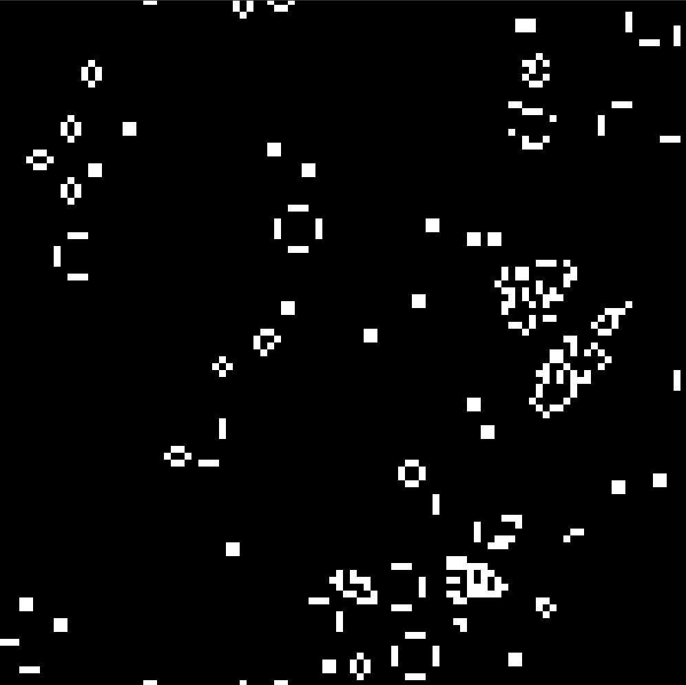

# Life

Conway's Game Of Life in C++ and SFML

  

**The Game of Life**, also known simply as **Life**, is a cellular automaton devised by the British mathematician [John Horton Conway](https://en.wikipedia.org/wiki/John_Horton_Conway) in 1970. It is a zero-player game, meaning that its evolution is determined by its initial state, requiring no further input. One interacts with the Game of Life by creating an initial configuration and observing how it evolves. It is Turing complete and can simulate a universal constructor or any other Turing machine.

The Game rules are pretty simple : 

**If the cell is alive, then it stays alive if it has either 2 or 3 live neighbors**

**If the cell is dead, then it springs to life only in the case that it has 3 live neighbors**

More info : [Game Of Life](https://en.wikipedia.org/wiki/Conway%27s_Game_of_Life)


## Installation

Clone the repo

```
git clone https://github.com/ihebhaboubi/Life.git
cd Life
```

Compile and run 

```
make
./life
```

## Usage

The game starts initially with a grid of dead and live cells created randomly

You can quit the Game  by pressing **Q**. You can reset the game by Pressing **R** 
